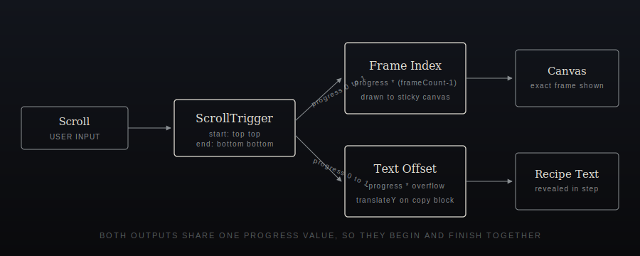
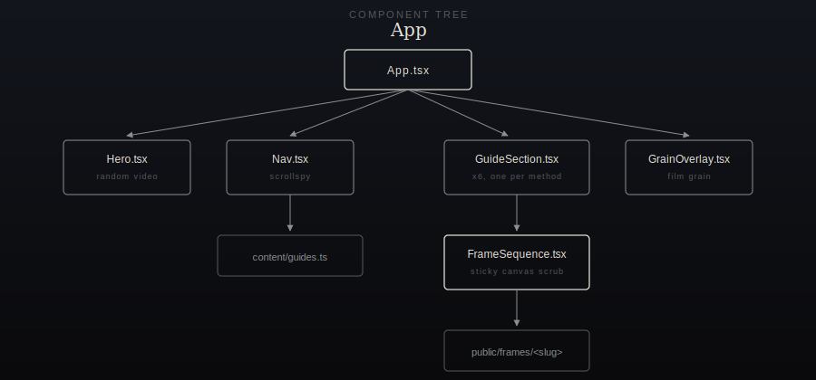

<div align="center">

# Abyssal Liturgy
### A Rite of Coffee

A single-page, scroll-driven brewing guide for six coffee methods, built as
a React and TypeScript SPA. Each method is illustrated with a frame-by-frame
video sequence scrubbed by scroll position, the same technique used on
Apple's product pages, powered by GSAP 3 and ScrollTrigger.

[](../../actions)
[](./LICENSE)
[](https://react.dev)
[](https://www.typescriptlang.org)
[](https://vitejs.dev)
[](https://gsap.com)
[](../../pulls)

</div>

<br/>

## Overview

Six vessels, six rites: Pour Over, French Press, AeroPress, Moka Pot,
Espresso Machine, and Cold Brew Tower. No ordering flow, no accounts, no
backend. Pure editorial content paired with cinematic, scroll-controlled
motion.

- **Frame-by-frame scroll video.** Each guide's source clip (6s at 24fps,
  145 frames) is pre-extracted into a JPEG sequence and scrubbed onto a
  `<canvas>` in exact lockstep with scroll position. The clip can never be
  scrolled past before its last frame, and it never auto-advances without
  scroll input.
- **Synced recipe text.** The copy for each method starts visible with no
  gap and moves upward more slowly than the page scrolls, so both the
  video and the text finish together, regardless of how long the recipe is.
- **Randomized, sound-gated hero.** A different brew method's clip plays
  muted on every load. One tap on "Play with sound" unmutes and plays it
  once through.
- **Smart single-page navigation** with scrollspy highlighting of the
  active method.
- **Fully responsive**, with a stacked, non-pinned layout on narrower
  viewports.
- **Zero backend.** Static build, deployable straight to GitHub Pages.

<br/>

## How the scroll sync works

<p align="center">
  
</p>

A single `ScrollTrigger` per guide section reports one progress value from
`0` to `1` across the section's full scroll span. That value maps directly
to a frame index for the canvas, and separately to a small vertical offset
for the recipe text, capped at the text's own overflow. Because both
outputs are driven by the same progress number, they start together and
finish together no matter how long the copy is or how many frames the clip
has.

<br/>

## Component tree

<p align="center">
  
</p>

<br/>

## Tech stack

| Layer | Choice |
|---|---|
| UI | React 18 + TypeScript |
| Build | Vite 5 |
| Motion | GSAP 3 + ScrollTrigger |
| Hosting | GitHub Pages via GitHub Actions |
| Styling | Hand-written CSS design system (no framework) |

<br/>

## Local development

```bash
npm install
npm run dev
```

## Build

```bash
npm run build
npm run preview
```

## Deploy (GitHub Pages)

This repo ships a GitHub Actions workflow
(`.github/workflows/deploy.yml`) that builds the site and publishes
`dist/` to GitHub Pages on every push to `main`.

One-time setup:

1. Push this repository to GitHub.
2. In the repo, go to **Settings > Pages** and set **Source** to
   **GitHub Actions**.
3. Confirm the Vite `base` path in `vite.config.ts` matches your repo
   name exactly, case-sensitive. For `https://username.github.io/abyssalLiturgy/`
   the base should be `/abyssalLiturgy/`. For a root user or
   organization site (`username.github.io`), set `base: '/'`.
4. Push to `main`. The workflow builds and deploys automatically.

Update the badge URL at the top of this file to point at your own
`owner/repo` once pushed, so the deploy status badge reflects real runs.

<br/>

## Regenerating frame sequences from source video

If you replace a source clip, regenerate its frames with ffmpeg. Adjust
scale and quality to taste; the shipped frames are 420px-wide JPEGs:

```bash
ffmpeg -i source.mp4 -vf "scale=420:-1" -q:v 4 public/frames/<slug>/f_%04d.jpg
```

Update `frameCount` for that guide in `src/content/guides.ts` if the frame
count changes.

<br/>

## Project structure

```
src/
  components/
    Hero.tsx              random hero video, sound gated on first play
    Nav.tsx                sticky nav with scrollspy
    FrameSequence.tsx       scroll-scrubbed canvas video
    GuideSection.tsx        per-method layout, text and video sync
    GrainOverlay.tsx        film grain texture overlay
  content/
    guides.ts               all copywriting, steps, metadata
  hooks/
    useActiveSection.ts      IntersectionObserver scrollspy
  styles/
    global.css               Abyssal Liturgy design system
public/
  frames/<slug>/             extracted JPEG frame sequences
  videos/<slug>.mp4          full source clips, hero only
  video-posters/<slug>.jpg    poster frames
docs/
  assets/                     README diagrams (SVG)
```

<br/>

## License

Released under the [MIT License](./LICENSE).
